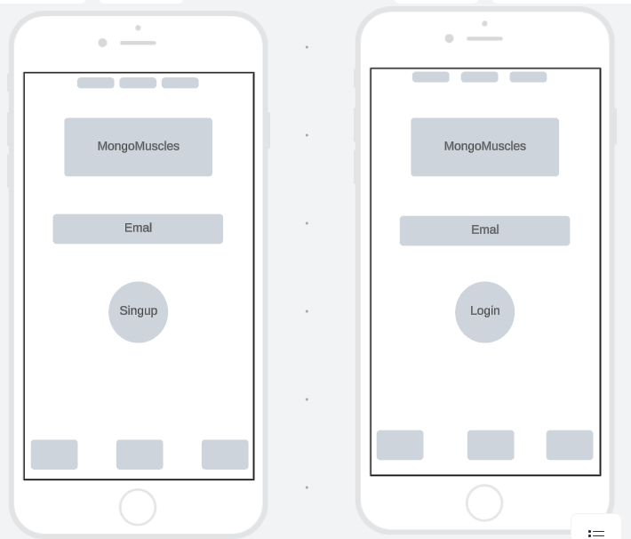
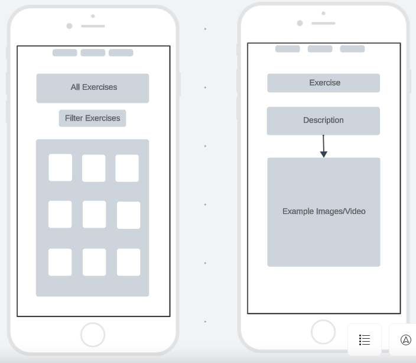
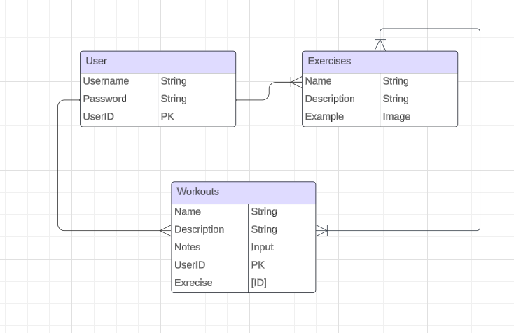

# MongoMuscles
MongoMuscles is a full-stack fitness application designed to guide your workout journey. Whether you're a fitness enthusiast or just starting, MongoMuscles helps you discover and complete exercises tailored to your fitness goals.

## User Stories

**As a user:**
   - I want to view a list of exercises with details so that I can choose the ones suitable for my workout.
   - I want to access tutorial videos or instructions for each exercise.
   - I want to mark exercises and workouts as completed to track my progress.
   - As a fitness instructor, I want to create and share specialized workout plans with my clients, tailoring exercises to their fitness goals.

**Icebox:**
   - As a user, I want to filter workouts by category so that I can focus on specific a specific type of workout.
   - As a user, I want to log and monitor my dietary habits 
   - As a user, I want to sync my workout data with fitness wearables or apps.

## Wireframe

## ERD

